# Nios V Tutorial

In this tutorial, we will create and customize a soft processor with **Nios V** an embedded system with a processor and peripherals—embed it in an FPGA, and write code to control LEDs.

## Authors

| Name                         | Major                | Semester    | Contact                 | Year |
|------------------------------|----------------------|-------------|-------------------------|------|
| Pedro Paulo Moreno Camargo   | Computer Engineering | 7           | ppmcamargo@gmail.com    | 2024 |
| Felipe Aaron                 | Computer Engineering | *[Semester]* | *[Email]*               | 2024 |

---

## Getting Started

To follow this tutorial, you will need:

- **Hardware**: DE10-Standard and DE0-CV development boards
- **Software**: Quartus 23.1std (23.1.1) or later, and Ashling RiscFree IDE
- **Operating System**: Windows
- **Documentation**:

    | Document                                                                              | Description                                                   |
    |---------------------------------------------------------------------------------------|---------------------------------------------------------------|
    | [DE10-Standard User Manual](./pdfs/DE10-Standard_User_manual.pdf)                     | Detailed information on the DE10-Standard development board.  |
    | [DE0-CV User Manual](./pdfs/DE0_CV_User_Manual_v1.12.pdf)                             | Detailed information on the DE0-CV development board.         |
    | [Nios® V Processor Tutorial](./pdfs/an-784468-784469.pdf)                             | Tutorial on the Nios V processor.                             |
    | [Nios® V Processor Reference Manual](./pdfs/ug20343-683632-679983.pdf)                | Reference manual for the Nios V processor.                    |

---

## RISC Architecture

!!! info "What is RISC?"
    **Reduced Instruction Set Computer (RISC)** is a computer architecture based on simplifying instructions so that each performs a single function. This contrasts with **Complex Instruction Set Computer (CISC)** architectures, which have complex instructions capable of multiple operations.

### Key Advantages of RISC

- **Increased Speed**: Simplified instructions can be executed faster, often in a single clock cycle.
- **Pipeline Efficiency**: Improved performance through instruction pipelining.
- **Simplicity**: Easier to design and implement due to the reduced complexity.

---

## RISC-V Overview

!!! example "What is RISC-V?"
    **RISC-V** is an open and free instruction set architecture (ISA) based on RISC principles, designed for flexibility and scalability.

### Key Features

- **Modularity**: Offers a minimal base ISA with optional standard extensions.
- **Open-Source**: Encourages innovation and reduces costs.
- **Versatility**: Suitable for applications ranging from embedded systems to high-performance computing.

---

## Nios V Processor

!!! note "Introducing Nios V"
    **Nios V** is a soft processor provided by Intel, integrated into Quartus, and based on the **RISC-V architecture**.

### Highlights

- **Customizable**: Allows addition of custom instructions implemented in HDL.
- **Versatile**: Ideal for various FPGA applications due to its flexibility.

---

## Comparing Nios V and Nios II

A comparison between Nios V (RISC-V-based) and Nios II (Altera's proprietary RISC):

### 1. Instruction Set Architecture (ISA)

=== "Nios II"

    !!! Quote
        *"Nios II is a 32-bit embedded processor architecture designed specifically for the Altera family of field-programmable gate array (FPGA) integrated circuits."*  
        [Wikipedia - Nios II](https://en.wikipedia.org/wiki/Nios_II)

=== "Nios V"

    !!! Quote
        *"The Nios V/m processor is a microcontroller core developed by Intel based on the RISC-V RV32IA instruction set..."*  
        [Intel Documentation](https://cdrdv2-public.intel.com/679983/ug20343-683632-679983.pdf)

---

### 2. Customizability

=== "Nios II"

    !!! Quote
        *"The soft-core nature of the Nios II processor lets the system designer specify and generate a custom Nios II core, tailored for his or her specific application requirements."*  
        [Wikipedia - Nios II](https://en.wikipedia.org/wiki/Nios_II)

=== "Nios V"

    !!! Quote
        *"The Nios V processor family is based upon the open-source RISC-V instruction set architecture (ISA), which provides a modular and extensible approach to processor design."*  
        [Intel Technical Documentation](https://www.intel.com/programmable/technical-pdfs/726952.pdf)

---

### 3. Toolchain

=== "Nios II"

    !!! Quote
        *"The Nios II EDS includes the following two closely-related software development tool flows: The Nios II SBT and The Nios II SBT for Eclipse. Both tool flows are based on the GNU C/C++ compiler."*  
        [Intel Documentation](https://cdrdv2-public.intel.com/705142/n2sw_nii5v2gen2-17-0-683525-705142.pdf)

=== "Nios V"

    !!! Quote
        *"The Nios V processor utilizes the open-source RISC-V GCC toolchain for software development, supported by Intel's Quartus Prime software for hardware integration."*  
        [Intel Technical Documentation](https://www.intel.com/programmable/technical-pdfs/726952.pdf)

---

### 4. Performance

=== "Nios V"

    !!! Quote
        *"The Nios V/m processor is designed to offer enhanced performance compared to its predecessors, leveraging the efficiencies of the RISC-V architecture."*  
        [Intel Technical Documentation](https://www.intel.com/programmable/technical-pdfs/726952.pdf)

---

## Setting Up the Tools

To get started with the project, you’ll need to download and install a few essential tools. These include **Quartus 23.1std (or later)** and the **Ashling RiscFree IDE**, which will be used to compile and run the project, respectively.

---

### Step 1: Download

If Quartus is not yet installed on your system, begin by downloading the necessary files from the [Intel Website](https://www.intel.com/content/www/us/en/software-kit/825278/intel-quartus-prime-lite-edition-design-software-version-23-1-1-for-windows.html). Ensure you download the following files:

!!! info "Required Downloads"
    - **Quartus Download**:  
      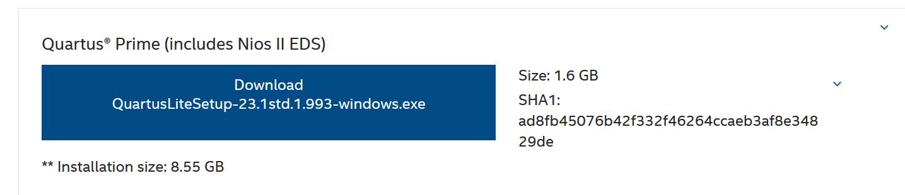
    - **Cyclone V Download**:  
      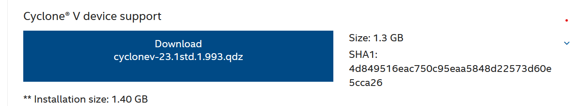
    - **Ashling RiscFree IDE Download**:  
      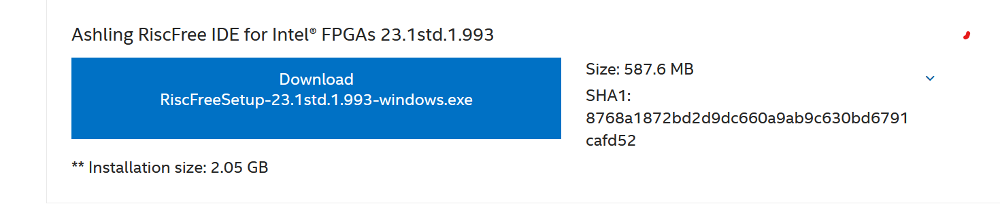

Once downloaded, place all files in the same folder, as shown below:

- **Grouped Files Example**:  
  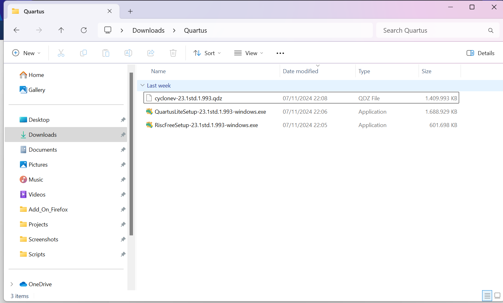

Now, run the `QuartusSetup.exe` file to initiate the installation process.

!!! note
    If Quartus is already installed, you only need to download the **Ashling RiscFree IDE** and run its executable to set it up as an external tool.

---

### Step 2: Downloading the License

Intel requires a license to use the Nios V IP in Quartus Prime Lite Edition. This license is essential to proceed with this project. Follow the instructions in the [License Nios V Guide](https://www.macnica.co.jp/en/business/semiconductor/articles/intel/140701/) to obtain the necessary license.

!!! warning
    - For this project, ensure you download the **Nios V/m IP** license specifically.
    - The license is valid for one year and will need to be renewed afterward if you plan to continue using the Nios V IP.

---

### Step 3: Setting up the License

Once you receive the `.dat` license file via email, download it and place it in the `flexlm` folder located in the root directory (e.g., `C:\flexlm`). If the folder does not exist, create it.

To configure Quartus to recognize the license, follow these steps:

1. Go to **Tools ➡️ License Setup**, as shown below:  
   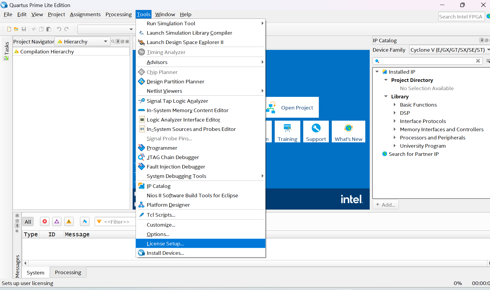

2. In the License Setup window:
    - Add the path to the `.dat` file in the **License File** field.

After completing these steps, your setup should resemble the following:  
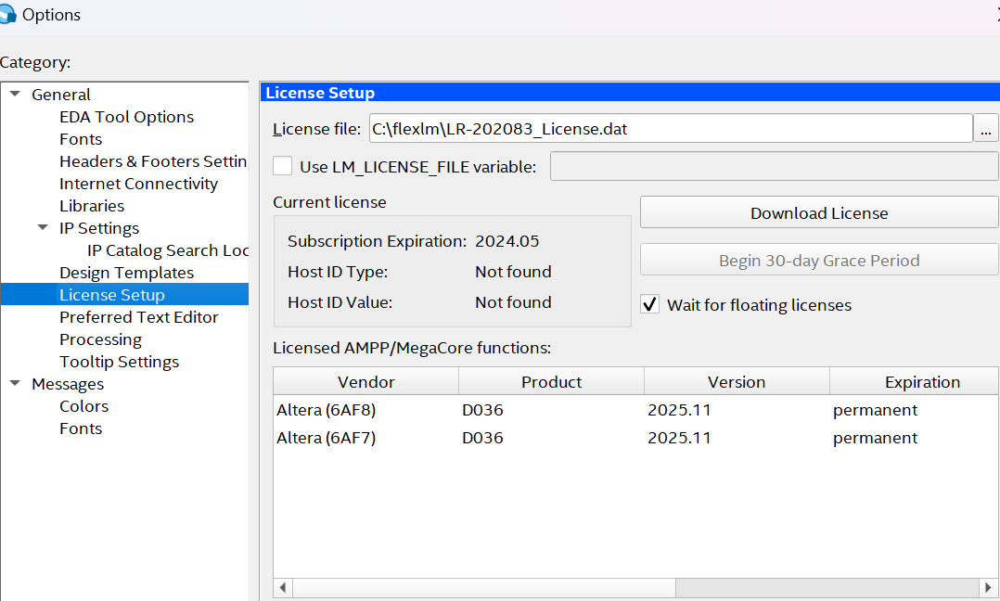

---

With everything now set up, you’re ready to begin working on the project.

---

## DE10-Standard
!!! WARNING
    This tutorial references both the [Tutorial FPGA RTL](https://insper.github.io/Embarcados-Avancados/Tutorial-FPGA-RTL/) and [Tutorial FPGA NIOS](https://insper.github.io/Embarcados-Avancados/Tutorial-FPGA-NIOS/). It’s recommended to go through these tutorials first, as they cover essential concepts like project creation, the Pin Planner, Platform Designer, and more.

---

### Step 1: Creating The Project

In Quartus: **File ➡️ New Project Wizard**

1. **Directory, Name, Top-Level Entity**

    - Choose the destination as your repository.

    - Name the project as `niosv`.

2. **Project Type**
    - Select **Empty Project**.

3. **Add Files**
    - No files will be added at this stage.

4. **Family, Device & Board Settings**
    - Configure the FPGA settings as follows:
        - **Family**: Cyclone V
        - **Name**: 5CSXFC6D6F31C6  

        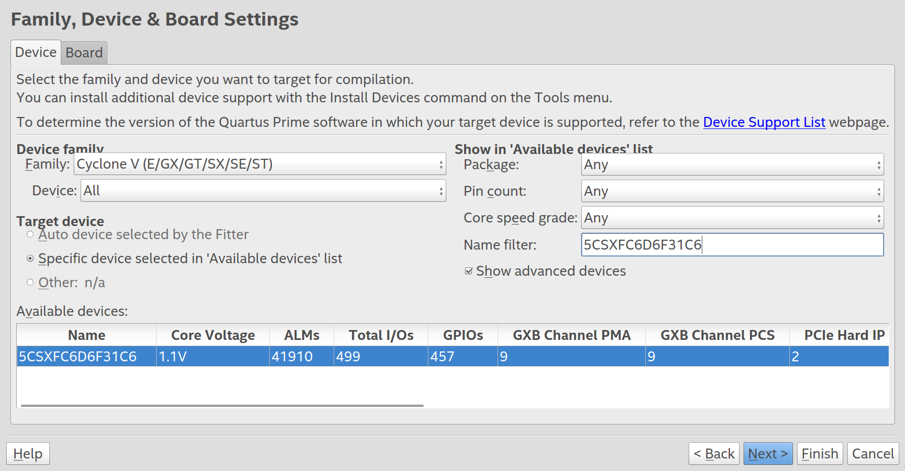

5. **Finalize the Wizard**
    - Click through to finalize and create the project.

---

### Step 2: Adding the Toplevel

To set up the toplevel for the project, we need to create and define the signals. This project uses:

- **Input**: A clock signal.

- **Output**: Six LEDs.


#### Adding the Template Code

Open the `Nios_V_RTL.vhd` file and insert the following template code:


```vhdl
library IEEE;
use IEEE.std_logic_1164.all;

entity Nios_V_RTL is
    port (
        fpga_clk_50   : in  std_logic;
        fpga_led_pio  : out std_logic_vector(5 downto 0)
    );
end entity Nios_V_RTL;

architecture rtl of Nios_V_RTL is

begin

end rtl;
```

---

#### Setting the File as the Top-Level Entity

After saving the file, right-click it and configure it as the top-level entity:

- **Project ➡️ Set as Top-Level Entity**

---

### Step 3: Assigning the I/Os

First, compile the project by running **Analysis & Synthesis** so that the Pin Planner can automatically recognize the I/Os, eliminating the need to set names manually.

- Click on **Processing ➡️ Start ➡️ Start Analysis & Synthesis** or press `CTRL + K`.

---

#### Editing the Pin Assignments

To edit the pin assignments:

1. Go to **Assignments ➡️ Pin Planner**.

According to the [DE10-Standard User Manual](./pdfs/DE10-Standard_User_manual.pdf), your pin assignments should resemble the following configuration:

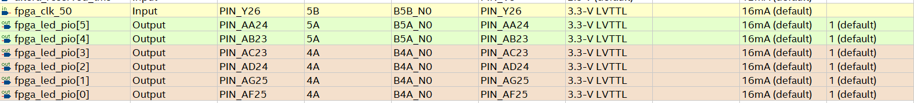

---

#### Creating a New Constraints File

To ensure proper clock assignment, create a new constraints file by following these steps:

1. Navigate to **File ➡️ New File ➡️ Synopsys Design Constraints File**.

2. Save the file with the name:


       ```plaintext
       Nios_V_RTL.sdc
       ```

3. Use the following template for the file content:

    ```plaintext
    # 50MHz board input clock
    create_clock -period 20 [get_ports fpga_clk_50]

    # Automatically apply a generated clock on the output of phase-locked loops (PLLs)
    derive_pll_clocks
    ```

---

#### Applying and Compiling the Changes

1. Click on **Processing ➡️ Start Compilation** or press `CTRL + L`.
2. After compiling, ensure there are no critical errors in the project.

---

### Step 4: Platform Designer (PD)

In this step, we will create a basic SoC with the following components:

- A **clock interface**
- A **memory** (data and program storage)
- The **Nios V** processor
- A **PIO** peripheral (for managing digital outputs)
- A **JTAG-UART** (for debugging via print statements)

---

#### Step-by-Step Guide

##### 1. Open Platform Designer

- Open Quartus.
- Navigate to **Tools ➡️ Platform Designer**.

##### 2. Add Components

Add the following components to your system with the specified configurations:

- **On-Chip Memory (RAM or ROM Intel FPGA IP)**
    - **Type**: RAM
    - **Memory Size**: 262144 bytes

- **JTAG UART Intel FPGA IP**
    - Use the **default settings**.

- **PIO (Parallel I/O) Intel FPGA IP**
    - **Width**: 6
    - **Direction**: Output

- **Nios V Processor**
    - **Type**: Nios V/m
    - Enable **Debug** and **Reset from Debug Module**.
    - **Reset Agent**: Select the **On-Chip Memory** you added.

##### 3. Make the Connections

Refer to the image below for correct connections:


---

##### 4. Assign Base Addresses

- To resolve memory assignment errors, click on **System ➡️ Assign Base Addresses**.
- This will automatically assign memory spaces without conflicts.

> **Note**: The warnings and informational messages shown below are expected and do not indicate any problems:

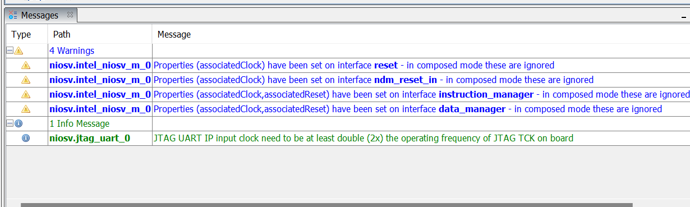

---

##### 5. Save the File

- Save your work using **File ➡️ Save As** or press `CTRL + S`.
- Use the name `niosv.qsys`.

---

##### 6. Generate HDL

1. Click on **Generate HDL** in Platform Designer.
2. In the **Create HDL Design Files for Synthesis** dialog, select **VHDL**.

---

!!! CONCLUSION
    Once you’ve completed these steps, the Platform Designer portion is done. You can now exit the PD window to proceed.

---

### Step 5: Compiling the Project

In this step, we will compile the project and prepare the Nios V system for execution. Follow the instructions below carefully.

---

#### 1. Add the `niosv.qip` File to the Project

- Navigate to **Project ➡️ Add/Remove Files in Project...**.

    ??? tip "Example"
        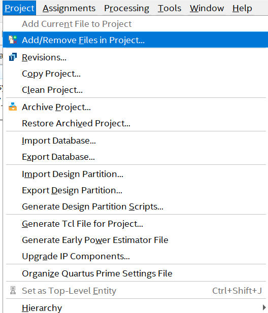

- Click on **Add**, select the `.qip` file, and then click **Apply**.

    ??? tip "Example"
        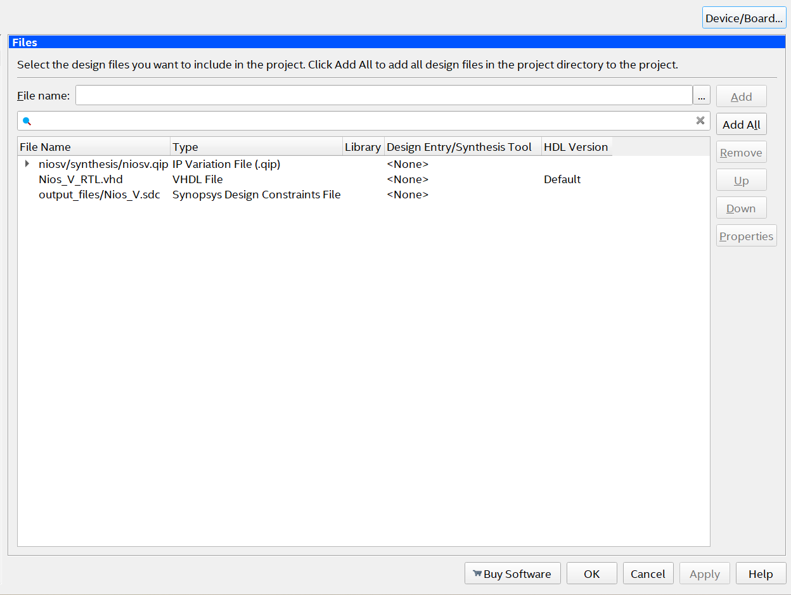

---

#### 2. Add the Nios V to the `Nios_V_RTL.vhd` File

Insert the following VHDL code into the `Nios_V_RTL.vhd` file. Ensure the ports and mappings match your design requirements.

```vhdl
library IEEE;
use IEEE.std_logic_1164.all;

entity Nios_V_RTL is
    port (
        -- Globals
        fpga_clk_50   : in  std_logic;
        fpga_led_pio  : out std_logic_vector(5 downto 0)
    );
end entity Nios_V_RTL;

architecture rtl of Nios_V_RTL is

component niosv is
        port (
            clk_clk       : in std_logic := 'X';
            reset_reset_n : in std_logic := 'X';
            leds_export   : out std_logic_vector(5 downto 0)
        );
end component niosv;

begin

u0 : component niosv
        port map (
            clk_clk       => fpga_clk_50,
            reset_reset_n => '1',
            leds_export   => fpga_led_pio
        );

end rtl;
```

#### 3. **Compiling**:
- Click on **Start Compilation** or press `CTRL+L`.

    ??? tip "Example"
        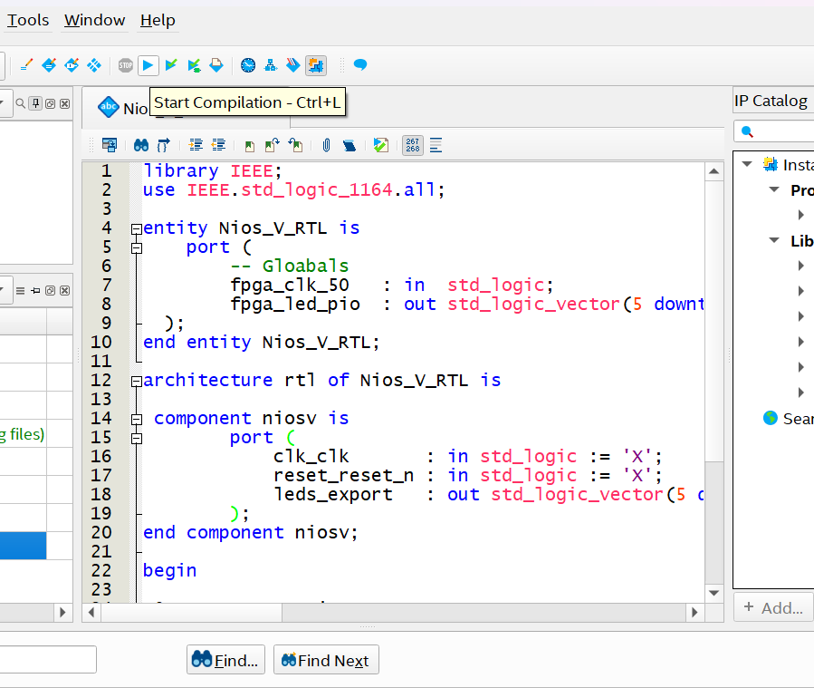

- After the compilation is done, click on **Program Device (Open Programmer)** in the task window.  

    ??? tip "Example"
        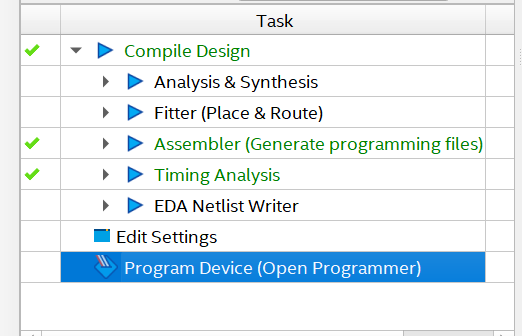

- Set the device as taught in tutorial 1 and click on **Start**.

    ??? tip "Example"
        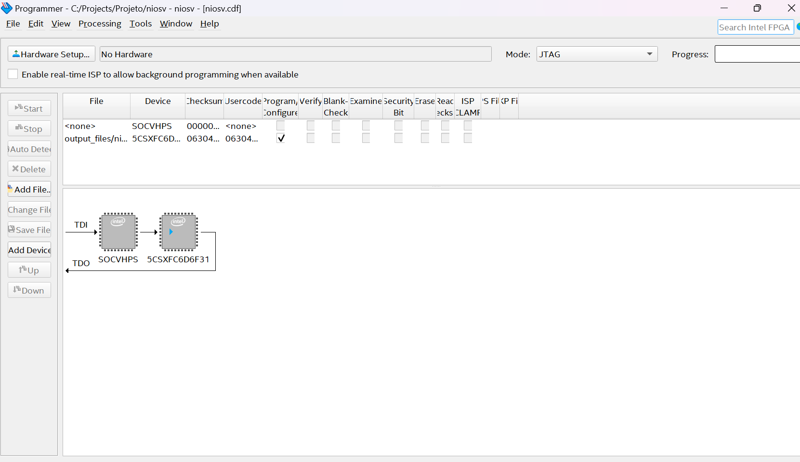

!!! CONCLUSION
    Now that Nios-V is set on the FPGA, we can proceed to programming the software.


---

### Step 6: Setting Up the Software

!!! INFO
    The **Board Support Package (BSP)** is a collection of software libraries and configuration files that provide the interface between the operating system or application software and the specific hardware of a system. It enables the software to correctly interact with the peripherals and functionalities defined in the hardware design.

To set up the BSP and software, complete the following steps:

1. **Opening the Shell**:
    - Open the `niosv-shell.exe` located at `intelFPGA_lite/23.1std/niosv/bin`.
    - Navigate to the project directory,

2. **Create the BSP**:
    - Run the following command:
        ```bash
        niosv-bsp -c -t=hal --sopcinfo=niosv.sopcinfo software/bsp/settings.bsp
        ```
    - **Explanation**:
        - **`niosv-bsp`**: This is the command to create a Board Support Package (BSP) for Nios V.
        - **`-c`**: Indicates that the BSP configuration will be created or updated.
        - **`-t=hal`**: Specifies the type of BSP as HAL (Hardware Abstraction Layer).
        - **`--sopcinfo=niosv.sopcinfo`**: Points to the `.sopcinfo` file, which describes the hardware system configuration.
        - **`software/bsp/settings.bsp`**: The location and name for the BSP settings file that will be generated.

    - This command ensures that a **Nios V BSP of type HAL** is created based on the hardware description provided in the `.sopcinfo` file, and it will be stored at the specified path: `software/bsp/settings.bsp`.

    - The response below should be shown after creating the BSP, and a software directory should be created at the root of the project containing the directory bsp and the file settings.bsp.

    ??? tip "Example"
        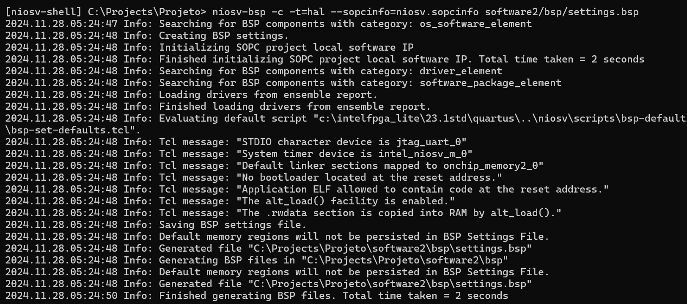

3. **Create the App**:
    - Create a new folder inside `/software` named `app`.
    - In the new folder, create a `.c` file named `leds.c`.
    - Run the following command:    
        ```bash
        niosv-app -a=software/app -b=software/bsp -s=software/app/leds.c
        ```
    !!! Explanation
        - **`niosv-app`**: This command is used to create a Nios V application.
        - **`-a=software/app`**: Specifies the application directory. Here, it points to `software/app`, where the application files are stored.
        - **`-b=software/bsp`**: Specifies the path to the BSP configuration directory created earlier.
        - **`-s=software/app/leds.c`**: Specifies the main source file for the application, in this case, `leds.c`.

    - This ensures that a new application is correctly linked with the previously created BSP, and the application files are initialized in the specified directory.

    - The response below should be shown after creating the application:

        ```bash
        2024.11.28.05:31:11 Info: "software\app\CMakeLists.txt" was generated.
        ```

    - This indicates that the application setup is complete and the necessary build files (`CMakeLists.txt`) have been successfully generated in the specified directory.

---

### Step 7: Programming the Software

#### Ashling RiscFree IDE
!!! INFO
    [RiscFree IDE](https://www.ashling.com/ashling-riscfree/) is an Integrated Development Environment (IDE) based on Eclipse, developed by Ashling to support the development of embedded applications for the RISC-V architecture. It provides a comprehensive suite of tools and features for software developers working with RISC-V-based processors and systems.

To program the software, complete the following steps:

1. **Open RiscFree IDE**
    - Type `riscfree` in the niosv-shell.
    - Select the **software** folder as the workspace path and click **Launch**.

2. **Creating the Project**
    - Click on **Create a project...**

        ??? tip "Example"  
            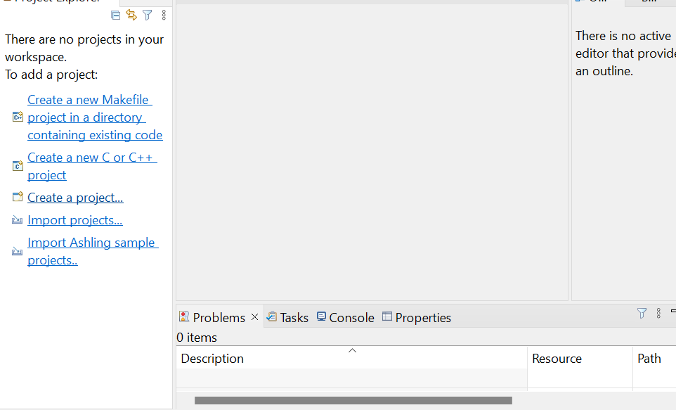

    - Select **C/C++ ➡️ C Project**.  

        ??? tip "Example"
            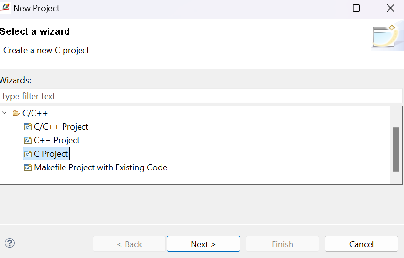

    - In the next step:
        - Select **CMake driven ➡️ Empty Project**.
        - Uncheck **Use default location**.
        - Set the **app** folder as the location and name the project **app**.  

            ??? tip "Example"
                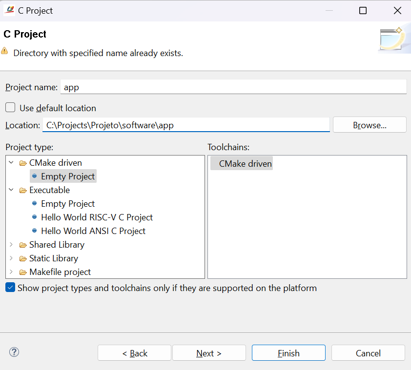

    - Finally, click **Finish** to create the project.

3. **Write the LED Code**
    - Open the **app** folder and click on `leds.c`, then write the following code:

    ```c
    #include <stdio.h>
    #include "system.h"
    #include <alt_types.h>
    #include <io.h> // For Avalon read/write

    void delay(int n) {
        volatile unsigned int delay = 0;
        while (delay < n) {
            delay++;
        }
    }

    int main(void) {
        unsigned int led = 0;

        printf("Embarcados++ \n");

        while (1) {
            if (led < PIO_0_DATA_WIDTH) { // Use defined data width of the PIO
                IOWR_32DIRECT(PIO_0_BASE, 0, 0x01 << led++);
                usleep(50000); // 50ms delay
            } else {
                led = 0;
            }
        }

        return 0;
    }
    ```

    !!! EXPLANATION
        - Initializes an LED counter (`led`) and prints "Embarcados++" to the console.
        - In the `while (1)` loop:
        - Shifts a bit left through the LEDs connected to the PIO, lighting them sequentially.
        - Uses `IOWR_32DIRECT` to write to the Avalon interface, controlling the LEDs.
        - Delays for 50ms using `usleep(50000)`.
        - Resets the counter (`led`) when it reaches the width of the PIO.

    This code makes the LEDs connected to the PIO blink sequentially in a loop, demonstrating basic hardware control using the Avalon memory-mapped interface.

4. **Build Project**
    - Right-click on the **app** folder and select **Build Project**.

        ??? tip "Example"  
            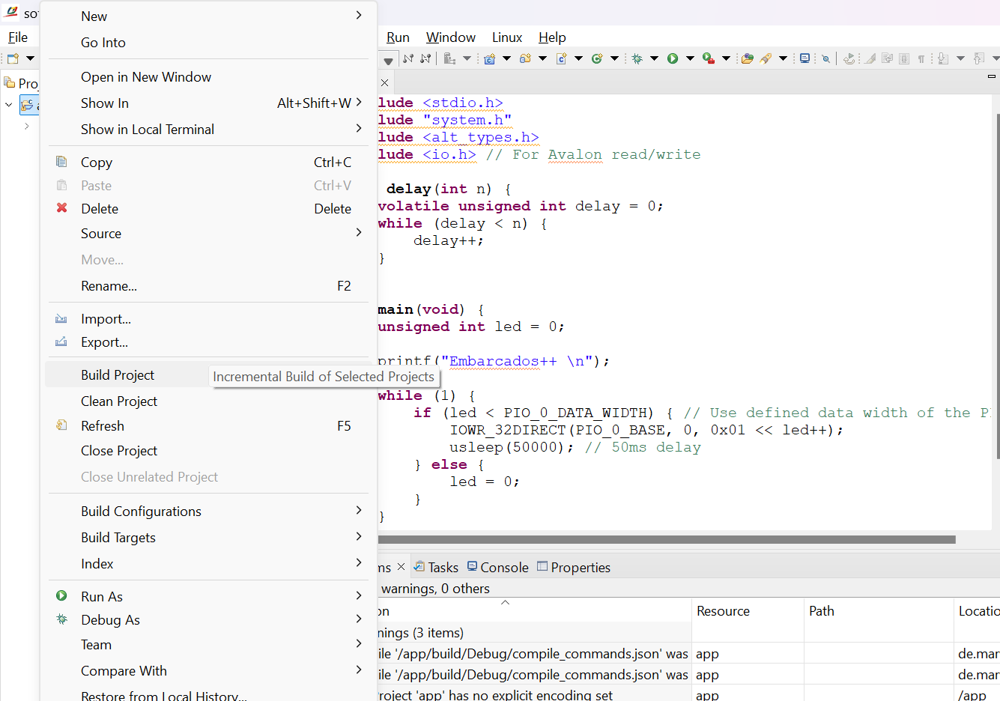

    - **Expected Console Output**:  
      In case of success, the console should display a message similar to the following:  
      ```text
      05:54:13 Buildscript generation finished (took 11216 ms)
      ```

5. **Connect the Juart**

!!! INFO
    The **JUART (JTAG UART)** is a hardware peripheral commonly used in FPGA designs for serial communication. It provides a simple way to transmit and receive data between an embedded system (like a Nios II or Nios V processor) and a host computer through a **JTAG (Joint Test Action Group)** interface.

- There are two ways to connect the Juart:

    1. **Connect via `niosv-shell`**:
        - Open a terminal and type:
            ```bash
            juart-terminal
            ```

    2. **Set up the Juart in the IDE as an External Tool**:
        - Navigate to **Run ➡️ External Tools ➡️ External Tools Configurations**.
        - Double-click on **Program** to create a new configuration.
        - Use the following settings:
            - **Location**:  
                ```text
                intelFPGA_lite/23.1std/quartus/bin64/juart-terminal.exe
                ```
            - **Arguments**:  
                ```text
                -c 1 -d 0 -i 0
                 ```
            - Click **Apply** to save the configuration.  

                ??? tip "Example"
                    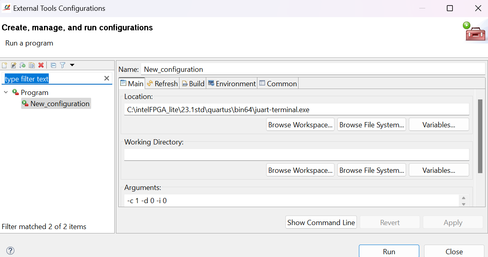

6. **Run**
    - Right-click on the **app** folder and select **Run as ➡️ Ashling RISC-V Hardware Debugging**.

        ??? tip "Example"      
            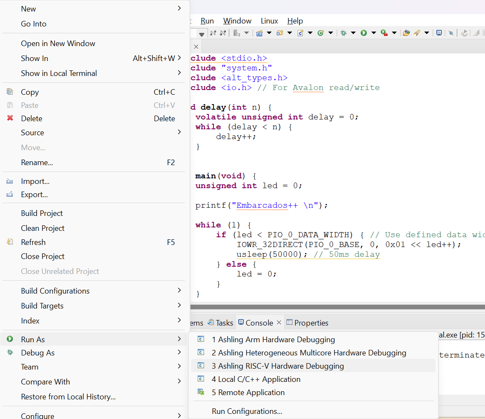
    - Select **app.elf** as the target file.  

        ??? tip "Example"
            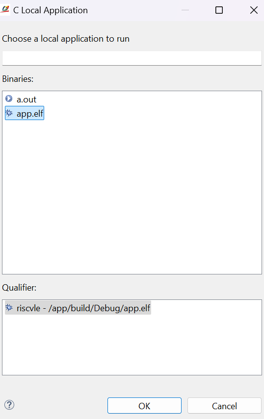
    - In the **Edit Configuration - Debugger** window:
        - Click on **Auto-detect Scan Chain**.
        - Change the **Device/Tap Selection** to the FPGA.
        - Click **Apply**.

            ??? tip "Example"
                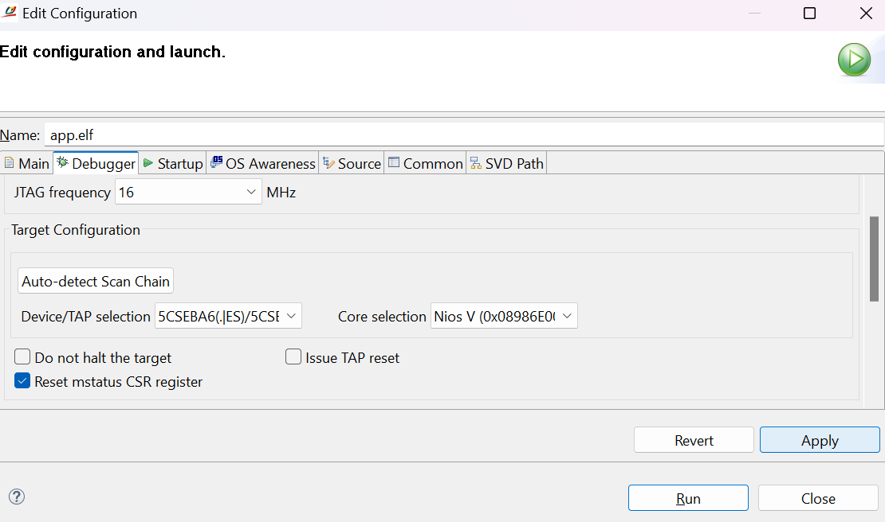

!!! CONCLUSION
    With all the steps completed, the application should run successfully, producing the expected result.

## Demonstration:

<iframe width="560" height="315" src="https://www.youtube.com/embed/NpRT9kBTpRw?si=8BuNt9kL9TfT690o" title="YouTube video player" frameborder="0" allow="accelerometer; autoplay; clipboard-write; encrypted-media; gyroscope; picture-in-picture; web-share" referrerpolicy="strict-origin-when-cross-origin" allowfullscreen></iframe>


---

*[Semester]*: Placeholder for semester information.
*[Email]*: Placeholder for contact email.
